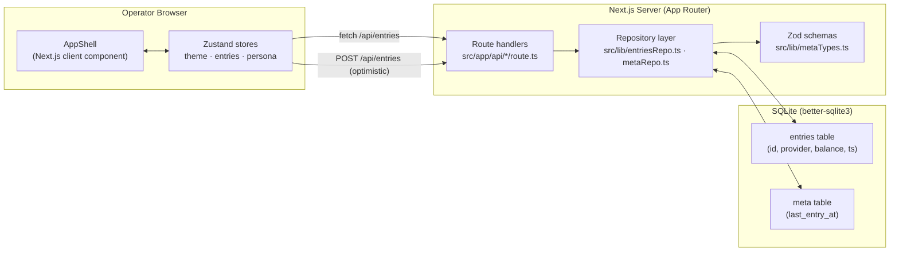

# WalletSync

### Multi-Provider Mobile Money Balance Viewer (bKash · Nagad · Rocket)

---

A manually-tracked, **read-only** balance viewer for the three mobile financial
services (MFS) providers a Bangladeshi user typically carries: **bKash**,
**Nagad**, and **Rocket**. Mobile-first, local-first, no provider API calls,
no PII.

WalletSync started life as the LiquiGuard prototype at the **bKash presents
SUST CSE Carnival 2026** hackathon. This repository is the **standalone
follow-up build**: the v1 dashboard UI plus the v1.1 server-persistence
phase (SQLite via Next.js API routes). The original LiquiGuard design
documents are preserved under [`docs/`](./docs) for history.

## Quick start

Requirements: **Node.js 20+** and **npm**.

```bash
cd frontend
npm install
npm run dev      # http://localhost:3001
```

The app boots with an empty Recent Entries log. Type a balance into any
provider card and it is written to `../data/walletsync.db`. Entries
survive a page reload, a server bounce, and a fresh clone of the repo
(the DB file is gitignored; the `data/` folder itself is tracked via
`.gitkeep`).

### Other useful scripts

```bash
npm run build         # production build
npm run typecheck     # tsc --noEmit
npm run lint          # eslint .
npm run test          # vitest run
npm run db:reset      # wipe local SQLite db
npm run db:seed       # insert demo entries
npm run smoke         # liveness probe against $WALLETSYNC_URL (default http://localhost:3001)
```

### Point at a writable volume

```bash
export WALLETSYNC_DB_PATH=/var/data/walletsync.db
npm run dev
```

## What's in this build

| Capability | Status |
| --- | --- |
| Total balance header + one card per provider | Shipped (v1) |
| Recent Entries log with per-provider badges | Shipped (v1) |
| Manual entry only — no provider API calls | By design |
| Local SQLite persistence (`data/walletsync.db`) | Shipped (v1.1) |
| Optimistic updates with rollback on POST failure | Shipped (v1.1) |
| Light / dark / system theme toggle | Shipped |
| Theme persisted across reloads (Zustand + `localStorage`) | Shipped |
| `POST /api/entries`, `GET /api/entries`, `GET /api/meta` API routes | Shipped (v1.1) |
| Unit tests for reducer, selectors, sparkline, repos | Shipped |
| Authentication, multi-device sync, payments | Explicitly out of scope |

The complete spec — including the v1 → v1.1 → deferred work rationale —
lives in [`WALLETSYNC_SPEC.md`](./WALLETSYNC_SPEC.md).

## Repository layout

```text
.
├── README.md                  # you are here
├── WALLETSYNC_SPEC.md         # full spec: v1 UI + v1.1 backend phase (§8)
├── data/                      # local SQLite db (gitignored; folder tracked via .gitkeep)
├── docs/                      # LiquiGuard context — domain, architecture, data flow
└── frontend/                  # Next.js + TypeScript app (run this)
    ├── src/
    │   ├── app/               # Next.js App Router — pages + API routes
    │   │   ├── api/entries/   # GET / POST /api/entries
    │   │   ├── api/meta/      # GET /api/meta (last entry timestamp)
    │   │   └── api/persona/   # GET / POST /api/persona/switch
    │   ├── features/          # Co-located UI by feature
    │   │   ├── shell/         # AppShell, theme store, persona switcher
    │   │   └── wallet/        # Cards, totals, sparkline, reducer
    │   └── lib/               # db, repos, types, time, sparkline helper
    ├── scripts/               # db-reset.mjs, seed-demo-data.mjs
    └── package.json
```

## Architecture

WalletSync is intentionally small. There is no background worker, no
real-time stream, no remote service. The whole flow is a single
Next.js process backed by a local SQLite file.



### Layer responsibilities

| Layer | Component | Responsibility | Failure mode handled |
| --- | --- | --- | --- |
| **Render** | `features/shell/AppShell.tsx` | One-page dashboard; theme + persona state owner | Theme boot script prevents flash on reload |
| **State** | `features/wallet/reducer.ts` + selectors | Pure reducer; selectors keep re-renders minimal | Optimistic updates roll back on POST failure |
| **Transport** | `fetch /api/entries` | Idempotent retry; preserves user-supplied `id` | Server returns 409 on conflict |
| **Validation** | Zod schemas in `lib/metaTypes.ts` | Reject malformed payloads at the boundary | Returns HTTP 400 with field errors |
| **Persistence** | `better-sqlite3` via `lib/db.ts` | Single-file DB, WAL mode, prepared statements | DB locked → throws, caller returns 503 |
| **Repo** | `entriesRepo.ts` / `metaRepo.ts` | Transactional writes, paginated reads | One write = one transaction |

### The optimistic-update contract

Every provider-card POST goes through the same pattern:

1. The reducer applies the new balance **immediately** so the UI updates.
2. The same entry is sent to `POST /api/entries`.
3. On `2xx` the entry is committed in local state.
4. On `4xx/5xx` the reducer **rolls back** to the pre-POST value and the
   card surfaces the error. No half-saves ever persist.

This is enforced in `features/wallet/reducer.ts` and the calling
component in `features/wallet/ProviderBalanceCard.tsx`.

## API surface

All routes are App Router handlers under `frontend/src/app/api/`. The
default port is `3001`.

| Method | Path | Body | Returns | Notes |
| --- | --- | --- | --- | --- |
| `GET` | `/api/entries` | — | `{ entries: Entry[] }` | Newest first; cursor pagination via `?before=` |
| `POST` | `/api/entries` | `EntryInput` | `{ entry: Entry }` | Idempotent on client-supplied `id`; returns 409 on conflict |
| `GET` | `/api/meta` | — | `{ last_entry_at: string \| null }` | Timestamp of the most recent committed entry |
| `GET` | `/api/persona/switch` | — | `{ persona: string }` | Current persona id from cookie |
| `POST` | `/api/persona/switch` | `{ persona: string }` | `{ persona: string }` | Sets the persona cookie for the session |

Entry payloads are validated by the Zod schemas in `lib/metaTypes.ts`.
The wire format is intentionally identical to the row stored in SQLite.

## Data model

SQLite, single file at `data/walletsync.db`. Two tables, both created
by `lib/db.ts` on first boot if absent.

```text
+----------------+        +---------------------+
| entries        |        | meta                |
|----------------|        |---------------------|
| PK id TEXT     |        | PK key TEXT         |
|    provider    |        |    value TEXT       |
|    balance     |        |    updated_at       |
|    ts          |        +---------------------+
|    note        |
+----------------+
```

| Column | Type | Notes |
| --- | --- | --- |
| `entries.id` | `TEXT` | Client-supplied UUID; serves as the idempotency key |
| `entries.provider` | `TEXT` | `bkash` · `nagad` · `rocket` (allowlisted by Zod) |
| `entries.balance` | `REAL` | BDT; stored verbatim, displayed in `৳` |
| `entries.ts` | `TEXT` | ISO-8601 UTC; client supplies |
| `entries.note` | `TEXT \| NULL` | Optional free-text annotation |
| `meta.key` | `TEXT` | Primary key (e.g. `last_entry_at`) |
| `meta.value` | `TEXT` | Serialised value |
| `meta.updated_at` | `TEXT` | ISO-8601 UTC |

The DB is opened in **WAL** mode with `better-sqlite3`'s prepared
statement cache. All writes run inside `db.transaction(...)`; the
repo layer never executes raw multi-statement strings.

## Theme toggle (light / dark / system)

The top-right of the shell carries a three-state theme button. Click
cycles **light → dark → system → light**. The preference is persisted
in `localStorage` under `walletsync.theme`. `system` follows the OS
via `prefers-color-scheme` and updates live when the OS flips.

An inline boot script in `frontend/src/app/layout.tsx` applies the
`dark` class to `<html>` **before** React hydrates, so there is no
flash on reload.

## Observability and testing

WalletSync is small enough that "metrics" is the unit-test suite and
the visible UI. There is no metrics endpoint and no remote log
pipeline.

```bash
npm run test       # vitest run — reducer, selectors, repos, sparkline
npm run typecheck  # tsc --noEmit
npm run lint       # eslint .
npm run build      # production build (also catches SSR/SSG errors)
```

The repository's CI gate is `npm run typecheck && npm run lint &&
npm run test && npm run build`. No commit is shipped green without
all four passing.

## Deployment

The frontend is a standard Next.js 16 application. Any platform that
runs `next start` works — Vercel, Netlify, Render, Fly, a plain VM.

| Setting | Value |
| --- | --- |
| Build command | `npm run build` |
| Start command | `npm run start` (binds to `$PORT`, defaults to `3001`) |
| Node version | 20+ |
| Persistent volume | Mount `data/` (or set `WALLETSYNC_DB_PATH`) |
| Environment variables | None required for default SQLite mode |

### Mounting the SQLite volume

Because the DB is a local file, the **deploy target must persist
`data/`** between deploys. The recommended pattern:

```text
# Render disk example
disk:
  name: walletsync-data
  mountPath: /var/data
envVars:
  - key: WALLETSYNC_DB_PATH
    value: /var/data/walletsync.db
```

If you skip this step, every cold start of the service wipes the DB.

## Security and privacy

WalletSync is built on three commitments that the rest of the codebase
never quietly violates.

| Commitment | Where it is enforced |
| --- | --- |
| **No provider API calls** — every balance is hand-entered | There is no provider integration code in the repo |
| **No PII** — names, numbers, NIDs, device fingerprints | Schema accepts only provider, balance, timestamp, optional note |
| **No network sync** — local SQLite only | There is no auth, no session store, no external fetch |

The API routes accept JSON, validate it through Zod, and reject
malformed payloads with HTTP 400. Provider names outside the
`bkash` · `nagad` · `rocket` allowlist are rejected. Entries with
negative balances are rejected.

If you want to extend WalletSync with a real backend, sync layer, or
auth provider, **read `WALLETSYNC_SPEC.md` §7 first** — it lists the
deferred work and the rationale for keeping it deferred.

## Status

| Phase | Scope | State |
| --- | --- | --- |
| **v1** | Frontend dashboard (cards, totals, recent entries, theme) | Shipped |
| **v1.1** | SQLite persistence + API routes + optimistic updates | Shipped |
| v2 | Multi-device sync, auth, payments | Explicitly deferred |

See [`WALLETSYNC_SPEC.md`](./WALLETSYNC_SPEC.md) §7 for the deferred-work
plan and §8 for the v1.1 backend-phase contract.

## Credits

Built and maintained by **Bikash Talukder**
([bikashtalukder040@gmail.com](mailto:bikashtalukder040@gmail.com)).

Originally prototyped as part of the **bKash presents SUST CSE
Carnival 2026** hackathon. The LiquiGuard domain documents in
[`docs/`](./docs) were authored during that hackathon and are
preserved here unchanged.
