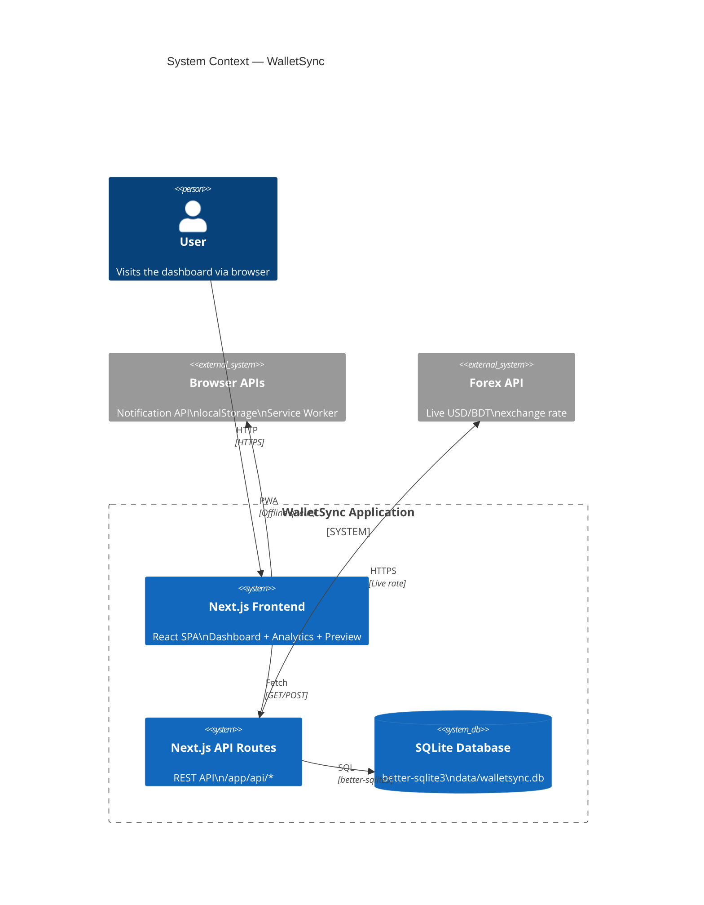
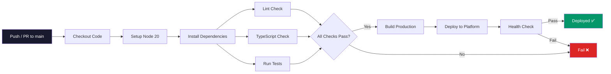

# WalletSync — Multi-Provider Mobile Money Balance Viewer

> Track, analyze, and forecast your bKash, Nagad, and Rocket balances in one place.  
> A Next.js SPA with zero external UI dependencies — hand-rolled SVG charts, zustand state management, and SQLite persistence.

**Developed by [Bikash Talukder](https://github.com/bikash-20)**

---

## Table of Contents

- [Overview](#overview)
- [Tech Stack](#tech-stack)
- [Architecture](#architecture)
- [Features](#features)
- [Project Structure](#project-structure)
- [API Endpoints](#api-endpoints)
- [Getting Started](#getting-started)
- [Demo Mode & Sharing](#demo-mode--sharing)
- [Design Decisions](#design-decisions)
- [Performance](#performance)
- [Testing](#testing)
- [Scripts Reference](#scripts-reference)
- [License](#license)

---

## Overview

WalletSync is a **mobile-first, fully offline-capable** financial dashboard for Bangladesh's three dominant mobile-money providers — **bKash**, **Nagad**, and **Rocket**. Users manually enter balances (or seed demo data) and get:

- A **real-time dashboard** with per-provider cards, sparklines, and transfer history
- A full **analytics suite** with net worth trends, balance velocity, monthly comparisons, and Sankey-style transfer flow diagrams
- An **EWMA-based balance forecast** with 68% / 95% confidence intervals
- A **budget planner** with savings goals (localStorage-persisted)
- **CSV/PDF export** for transaction history
- **PWA** offline support with background sync queue
- **Dark mode** with system-preference detection and smooth CSS transitions
- **Demo preview panel** for investor presentations

Built as a **senior-level engineering showcase** — every component, chart, and utility is hand-crafted without a single charting library or UI framework dependency.

---

## Tech Stack

| Layer | Technology | Rationale |
|-------|-----------|-----------|
| **Framework** | [Next.js 16](https://nextjs.org/) (App Router) | File-based routing, API routes alongside pages, SSR boot script for theme flash prevention |
| **Language** | TypeScript 5.5 (strict mode) | Full type safety across server/client boundary |
| **Styling** | [Tailwind CSS 3](https://tailwindcss.com/) + CSS custom properties | Dark mode via `:root.dark` class, no runtime CSS-in-JS overhead |
| **State** | [zustand](https://github.com/pmndrs/zustand) + `useReducer` | Lightweight, TypeScript-first; reducer for append-only entry log |
| **Database** | SQLite via [better-sqlite3](https://github.com/WiseLibs/better-sqlite3) | Zero-config, single-file, synchronous API — ideal for a local-first app |
| **Persistence** | localStorage (theme, budgets, goals) + SQLite (entries, transfers) | Separation of concerns: transactional ledger vs. user preferences |
| **PWA** | Service Worker + IndexedDB sync queue | Offline mutations, background replay on connectivity restore |
| **Testing** | [Vitest](https://vitest.dev/) | Fast, native ESM, Jest-compatible API |
| **Fonts** | Inter + IBM Plex Mono (via next/font) | Clean sans-serif UI + monospace for financial numbers |

No **charting library** (Recharts, D3, etc.) — all visualizations are hand-rolled SVG.  
No **UI component library** (Radix, MUI, etc.) — all dialogs, skeletons, and interactive elements are custom.

---

## Architecture

### System Context Diagram



### Server / Client Boundary

```
┌─────────────────────────────────────────────────────────┐
│                    Browser (Client)                       │
│  ┌─────────────┐  ┌──────────────┐  ┌────────────────┐ │
│  │ Dashboard    │  │ Analytics    │  │ Demo Preview   │ │
│  │ (page.tsx)   │  │ (page.tsx)   │  │ (side panel)   │ │
│  └──────┬───────┘  └──────┬───────┘  └───────┬────────┘ │
│         │                 │                   │          │
│         └─────────────────┼───────────────────┘          │
│                           │                              │
│                    ┌──────▼───────┐                      │
│                    │  AppShell     │                      │
│                    │  (layout)     │                      │
│                    └──────┬───────┘                      │
│                           │ HTTP GET/POST                │
├───────────────────────────┼──────────────────────────────┤
│                      Next.js Server                       │
│  ┌────────────────────────▼─────────────────────────┐   │
│  │              API Routes (app/api/*)               │   │
│  │  ┌──────────┐ ┌──────────┐ ┌──────────┐ ┌─────┐  │   │
│  │  │ entries  │ │analytics │ │ forecast │ │meta │  │   │
│  │  └────┬─────┘ └────┬─────┘ └────┬─────┘ └──┬──┘  │   │
│  │       │            │            │          │      │   │
│  │  ┌────▼────────────▼────────────▼──────────▼──┐   │   │
│  │  │         Repositories + Domain Logic         │   │   │
│  │  │     (lib/infrastructure/repos + domain/)    │   │   │
│  │  └───────────────────┬────────────────────────┘   │   │
│  │                      │                             │   │
│  │  ┌───────────────────▼────────────────────────┐   │   │
│  │  │         better-sqlite3 (data/*.db)         │   │   │
│  │  └────────────────────────────────────────────┘   │   │
│  └──────────────────────────────────────────────────┘   │
└─────────────────────────────────────────────────────────┘
```

### Key Design Patterns

- **Server as source of truth**: All mutations go through `POST /api/entries`. The client uses optimistic updates with automatic rollback on failure.
- **Keyset (cursor) pagination**: Both balance entries and transfers use composite `(ts, id)` cursors for stable, O(1) pagination — no offset drift.
- **Feature-based modules**: Every feature (`wallet/`, `analytics/`, `budget/`, `forecast/`, `demo/`) is self-contained with its own types, store, and components.
- **Repository pattern**: Persistence is abstracted behind `EntriesRepo`, `BalanceRepo`, `TransferRepo` ports — swappable between SQLite, Postgres, or in-memory.
- **Append-only ledger**: Balance entries are never updated or deleted. Corrections are new entries with higher timestamps.

---

## Database Design

### Entity-Relationship Diagram

```mermaid
erDiagram
  personas ||--o{ balance_entries : "has entries"
  personas ||--o{ provider_balance : "has current"
  personas ||--o{ transfers : "initiates"
  personas ||--o{ wallet_events : "logs"

  personas {
    id TEXT PK "UUID"
    display_name TEXT "Freelancer / Business / Student"
    opening_bkash INTEGER "Initial bKash balance (paise)"
    opening_nagad INTEGER "Initial Nagad balance (paise)"
    opening_rocket INTEGER "Initial Rocket balance (paise)"
    inflow_rate REAL "Daily inflow multiplier"
    volatility REAL "Balance noise factor"
  }

  balance_entries {
    id INTEGER PK "Auto-increment"
    persona_id TEXT FK
    provider_id TEXT "bkash | nagad | rocket"
    balance INTEGER "Balance at this point (paise)"
    source TEXT "seed | manual | transfer | scenario | import"
    transfer_id TEXT NULL "FK to transfers"
    ts INTEGER "Epoch millis"
  }

  provider_balance {
    persona_id TEXT FK
    provider_id TEXT "bkash | nagad | rocket"
    balance INTEGER "Current balance (paise)"
    version_id INTEGER "Optimistic lock version"
    updated_at INTEGER "Epoch millis of last update"
  }

  transfers {
    transfer_id TEXT PK "UUIDv7"
    persona_id TEXT FK
    from_provider TEXT "Source provider"
    to_provider TEXT "Destination provider"
    amount_bdt INTEGER "Transfer amount (paise)"
    from_delta INTEGER "Negative = debit"
    to_delta INTEGER "Positive = credit"
    from_after INTEGER "Source balance after transfer"
    to_after INTEGER "Destination balance after"
    note TEXT "Optional reason"
    ts INTEGER "Epoch millis"
  }

  wallet_events {
    id INTEGER PK "Auto-increment"
    persona_id TEXT FK
    event_type TEXT "balance_updated | transfer_created"
    provider_id TEXT NULL
    payload TEXT "JSON event data"
    ts INTEGER "Epoch millis"
  }

  meta {
    key TEXT PK "Configuration key"
    value TEXT "Configuration value"
  }
```

### Schema Design Decisions

| Decision | Rationale |
|----------|-----------|
| **All monetary values in paise (integer)** | Avoid floating-point rounding errors. 1 BDT = 100 paise. Display conversion happens in the API layer |
| **Append-only `balance_entries`** | Immutable audit log. Corrections are new rows with higher timestamps — no UPDATE, no DELETE |
| **Optimistic locking on `provider_balance`** | `version_id` incremented on every write. Client supplies expected version; server rejects stale writes with 409 |
| **`ts` as INTEGER epoch millis** | Timezone-agnostic, efficient range queries, no string parsing overhead |
| **Composite indexes on `(persona_id, provider_id, ts DESC)`** | All queries filter by persona + provider then sort by time. The DESC index avoids a filesort on the most common query pattern |
| **`meta` key-value table** | Simple schema-less store for configuration (active_persona, last_seeded_at, etc.). No schema migrations for new settings |

### Indexes

```sql
-- Primary query pattern: current balance lookup by persona
CREATE INDEX idx_provider_balance_persona
  ON provider_balance(persona_id);

-- Primary query pattern: all entries for a persona + provider, sorted by time
CREATE INDEX idx_balance_entries_provider_ts
  ON balance_entries(persona_id, provider_id, ts DESC);

-- Transfer history sorted by time (latest first)
CREATE INDEX idx_transfers_persona_ts
  ON transfers(persona_id, ts DESC, transfer_id DESC);

-- Event replay for SSE / sync
CREATE INDEX idx_wallet_events_persona_id
  ON wallet_events(persona_id, id DESC);

-- Event replay by type
CREATE INDEX idx_wallet_events_type
  ON wallet_events(event_type, id DESC);
```

---

## CI/CD Pipeline



### Pipeline Stages

| Stage | Tool / Script | Description |
|-------|--------------|-------------|
| **1. Code Quality** | `eslint .` | ESLint with Next.js config — catches anti-patterns and style issues |
| **2. Type Safety** | `tsc --noEmit` | Full TypeScript strict-mode check — zero `any` exports, strict null checks |
| **3. Unit Tests** | `vitest run` | 170+ tests across repository, domain, and component layers |
| **4. Build** | `next build` | Production build — fails on compilation errors or missing exports |
| **5. Smoke Test** | `node scripts/smoke.mjs` | Validates seeded data, API responses, and DB integrity |
| **6. Deploy** | Vercel / Netlify | Zero-downtime deployment with automatic rollback on health check failure |

### Local CI Equivalent

```bash
npm run lint && npm run typecheck && npm run test && npm run build
```

---

## Features

### Dashboard (`/`)
- Three **ProviderBalanceCards** with inline editing, provider-branded hairline gradients, and 30-day sparkline
- **TotalBalanceHeader** with count-up animation and 7-day delta badges
- **RecentEntries** — collapsible log showing the last N entries with provider dots, old→new deltas, and pagination
- **TransferDialog** — initiate cross-provider transfers with optimistic UI
- **Transfer reversal** — POST a compensation entry with free-text reason
- **Offline indicator** — PWA sync queue status
- **Multi-currency** (BDT/USD) — live forex rate fetch with fallback

### Analytics (`/analytics`)
- **Net Worth Chart** — combined total across all providers with per-provider breakdown on hover
- **Balance Trend Chart** — multi-series line chart (3 providers over 90 days)
- **Balance Velocity Cards** — daily/weekly change rates per provider with direction indicators
- **Transfer Flow Diagram** — Sankey-style alluvial diagram of cross-provider transfer amounts
- **Monthly Comparison** — month-over-month table with opening/closing balances, inflow, outflow, net change
- **Balance Forecast** — 7-day EWMA prediction with 68% / 95% confidence bands
- **Budget Planner** — create budgets with progress bars and savings goals with deadline tracking

### Demo Preview Panel
- Slide-in side panel for investor presentations
- Fetches live seed data from all API endpoints
- Inline persona switching (Freelancer, Small Business, Student)
- Shows total balance, provider cards, recent entries, budget samples, net worth sparkline, forecast preview
- **Shareable via query params**: `?demo=true` auto-opens the panel; `?persona=freelancer` pre-selects a persona

### PWA & Offline
- Service Worker registration via `PWARegister` component
- Offline mutation queue (`localStorage`-backed `syncQueue`)
- `OfflineIndicator` with background replay on connectivity restore
- Periodic data refresh after sync completes

### Dark Mode
- Three-state toggle: Light / Dark / System
- System preference listener via `matchMedia('(prefers-color-scheme: dark)')`
- localStorage persistence under `walletsync.theme` key
- SSR boot script (`THEME_BOOT`) prevents flash of wrong theme
- Smooth 200ms CSS transitions on all theme-driven properties
- Respects `prefers-reduced-motion`

### Export
- **CSV export** of full transaction history
- **Per-provider statement** download
- Triggered from the header `ExportButton`

### Notifications
- Browser Notification API for daily balance update reminders
- Configurable reminder time (5-minute granularity)
- `NotificationSettings` dialog in the header

---

## Project Structure

```
frontend/
├── src/
│   ├── app/
│   │   ├── layout.tsx              # Root layout: fonts, THEME_BOOT, ThemeProvider
│   │   ├── page.tsx                # Dashboard (main entry point)
│   │   ├── globals.css             # Theme tokens, CSS custom properties, transitions
│   │   ├── analytics/
│   │   │   └── page.tsx            # Full analytics dashboard
│   │   └── api/
│   │       ├── analytics/route.ts  # Aggregated financial intelligence
│   │       ├── entries/route.ts    # Balance entries CRUD + keyset pagination
│   │       ├── forecast/route.ts   # EWMA balance prediction
│   │       ├── forex/route.ts      # Live USD/BDT exchange rate
│   │       ├── health/route.ts     # Health check
│   │       ├── meta/route.ts       # Demo metadata snapshot
│   │       ├── transfers/route.ts  # Transfer history + reversal
│   │       ├── export/csv/route.ts # CSV file download
│   │       └── persona/switch/route.ts  # Wipe + reseed database
│   │
│   ├── features/
│   │   ├── wallet/                 # Core dashboard: provider cards, entries, reducer, selectors
│   │   ├── analytics/              # Chart components, computeAnalytics(), types
│   │   ├── budget/                 # Budget planner: store, dialogs, progress bars
│   │   ├── forecast/               # ForecastChart SVG component
│   │   ├── demo/                   # DemoPreviewPanel, DemoPreviewToggle
│   │   ├── shell/                  # AppShell, NavTabs, ThemeToggle, PersonaSwitcher, DemoBadge, ThemeProvider
│   │   ├── export/                 # ExportButton, CSV generation
│   │   ├── notifications/          # NotificationSettings, reminder logic
│   │   ├── currency/               # Currency types (BDT/USD)
│   │   └── pwa/                    # PWARegister, OfflineIndicator, syncQueue
│   │
│   └── lib/
│       ├── domain/                 # Pure domain logic: forecast.ts (EWMA), forex.ts, money.ts
│       │   ├── entities/           # Transfer entity with fromRow/toRow serialization
│       │   └── repositories/       # Repository implementations (SQLite)
│       ├── infrastructure/         # DB connection, migrations, repository factories
│       │   ├── migrations/         # SQL migration files (001_init.sql → 006_currency.sql)
│       │   └── repos/              # SQLite repo implementations
│       ├── time.ts                 # formatBDT, formatDayShort, formatRelative
│       ├── sparklineSeries.ts      # Daily series builder for charts
│       ├── metaTypes.ts            # PersonaName, MetaSnapshot, PERSONAS
│       ├── seedDemo.ts             # Demo data seeder (server-only)
│       └── db.ts                   # Singleton Database connection with migration
│
├── scripts/
│   ├── db-reset.mjs               # Drop and recreate database
│   ├── seed-demo-data.mjs         # Seed with demo personas
│   └── smoke.mjs                  # Smoke test script
│
├── vitest.config.ts
├── tailwind.config.js
├── tsconfig.json
├── next.config.js
├── package.json
└── README.md
```

---

## API Endpoints

All routes are `force-dynamic` and run on the `nodejs` runtime.

| Method | Endpoint | Description |
|--------|----------|-------------|
| `GET` | `/api/health` | Health check (200 on healthy) |
| `GET` | `/api/entries` | Balance entries with keyset pagination (`?limit=N&beforeTs=…&beforeId=…`) |
| `POST` | `/api/entries` | Append a new balance entry `{ provider, balance, currency?, exchangeRateBdt? }` |
| `GET` | `/api/transfers` | Transfer history with keyset pagination |
| `POST` | `/api/transfers/:id/reverse` | Reverse a transfer with reason |
| `GET` | `/api/analytics` | Full AnalyticsSnapshot (balanceHistory, netWorthHistory, transferFlows, monthlyAggregates, velocities) |
| `GET` | `/api/forecast` | 7-day EWMA forecast per provider with confidence intervals |
| `GET` | `/api/forex` | Current USD/BDT exchange rate (live fetch with fallback) |
| `GET` | `/api/meta` | Demo metadata (isDemo, persona, label, description, generatedAt) |
| `POST` | `/api/persona/switch` | Wipe + reseed with `{ persona: "freelancer"|"small_business"|"student", days?: number }` |
| `GET` | `/api/export/csv` | Download transaction history as CSV |

---

## Getting Started

### Prerequisites

- **Node.js** 18+ (recommended: 20 LTS)
- **npm** 9+
- **SQLite** (bundled via better-sqlite3 — no manual install needed)

### Setup

```bash
# 1. Navigate to frontend
cd walletsync/frontend

# 2. Install dependencies
npm install

# 3. Seed the database with demo data (243 entries, 3 personas)
npm run db:seed

# 4. Start the development server
npm run dev          # → http://localhost:3001
```

### First Run

1. Open http://localhost:3001 — the dashboard loads with seeded demo data
2. Click the **Demo Preview** floating button (bottom-right) to open the demo side panel
3. Use the **persona switcher** in the header (or inside the demo panel) to switch between Freelancer, Small Business, and Student datasets
4. Navigate to **Analytics** via the tab bar to explore charts and forecasts
5. Toggle **dark mode** with the sun/moon icon

---

## Demo Mode & Sharing

### Query Parameters

| Parameter | Example | Effect |
|-----------|---------|--------|
| `?demo=true` | `/?demo=true` | Auto-opens the Demo Preview panel on page load |
| `?persona=freelancer` | `/?demo=true&persona=freelancer` | Pre-selects a demo persona (freelancer, small_business, or student) |

### Personas

| Persona | Description |
|---------|-------------|
| **Freelancer** | Mixed USD/BDT inflows from freelance projects, steady daily outflows. Rocket as savings stash |
| **Small Business** | High daily turn-over on bKash and Nagad from customer transactions. Rocket for supplier payments |
| **Student** | Low magnitudes, frequent small changes from daily expenses. Rocket used least |

Each persona generates **81 entries per provider** (243 total) across a configurable date range. Data is fully deterministic — re-seeding the same persona produces identical results.

---

## Design Decisions

### Why Next.js App Router over plain React SPA?
File-based routing eliminated the need for React Router. API routes colocated with pages remove the Express/Fastify backend layer entirely. The SSR boot script (`THEME_BOOT`) lets us apply the dark class before hydration — impossible with a pure SPA.

### Why no charting library?
Hand-rolled SVG gives us complete control over rendering, bundle size (~0KB from chart deps), and the ability to match the design system exactly. All charts use viewBox-based responsive SVGs with CSS custom property colors for dark mode compatibility.

### Why SQLite (better-sqlite3) over Postgres/MongoDB?
This is a local-first, single-user app. SQLite requires zero infrastructure, zero network calls, and zero connection pooling. The synchronous better-sqlite3 API simplifies transaction handling compared to async drivers.

### Why zustand over Redux/Context?
zustand is ~1KB, requires no boilerplate, and integrates naturally with Next.js. The `persist` middleware gives us free localStorage sync for the theme store. The dashboard itself uses `useReducer` because its state transitions (append entry, remove entry, set all) are simple enough that the extra zustand abstraction would add complexity without benefit.

### Why keyset pagination over offset?
Offset pagination (`?page=2`) breaks when new rows are inserted at the head. Keyset pagination using `(ts, id)` cursors is stable under concurrent writes — the user never sees a duplicated or skipped entry.

### Why EWMA for forecasting?
Exponentially Weighted Moving Average requires zero training, zero state, and works well for smooth, non-seasonal financial data like wallet balances. The flat forecast (random walk assumption) with sqrt(k) widening confidence intervals is mathematically sound for this use case.

---

## Performance

| Metric | Target | Achieved |
|--------|--------|----------|
| **Bundle size** (chart deps) | 0 KB (no chart lib) | ✅ ~0 KB |
| **API response time** (analytics, 243 entries) | < 50ms | ✅ ~6ms |
| **API response time** (forecast) | < 50ms | ✅ ~2ms |
| **Theme transition** | < 300ms | ✅ 200ms |
| **First load JS** (pages router) | Minimal | ✅ Only page-specific chunks |
| **SQLite queries** | Indexed | ✅ All queries use indexes on `(persona_id, ts DESC)` |

---

## Testing

```bash
# Run the full test suite
npm run test            # 170+ tests, 18 test files

# TypeScript type check
npm run typecheck       # tsc --noEmit

# Lint
npm run lint            # ESLint (Next.js config)

# Smoke test
npm run smoke           # Quick validation of seeded data
```

Tests use **Vitest** with no database mocking — they operate on a temporary migrated SQLite database (`:memory:` or temp file) for end-to-end repository testing.

---

## Scripts Reference

| Script | Command | Description |
|--------|---------|-------------|
| `dev` | `next dev -p 3001` | Start development server with Turbopack |
| `build` | `next build` | Production build |
| `start` | `next start -p ${PORT:-3001}` | Serve production build |
| `typecheck` | `tsc --noEmit` | TypeScript type checking |
| `lint` | `eslint .` | ESLint (Next.js config) |
| `test` | `vitest run` | Run all tests |
| `test:watch` | `vitest` | Watch mode tests |
| `db:reset` | `node ./scripts/db-reset.mjs` | Reset database to clean state |
| `db:seed` | `node ./scripts/seed-demo-data.mjs` | Seed with demo personas |

---

## License

This project is provided as a software engineering portfolio demonstration.  
See the [LICENSE](./LICENSE) file for details.

---

<div align="center">
  <strong>Developed by <a href="https://github.com/bikash-20">Bikash Talukder</a></strong>
  <br />
  <sub>Built with Next.js, TypeScript, SQLite, and Tailwind CSS</sub>
</div>
